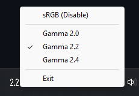
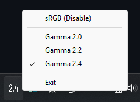
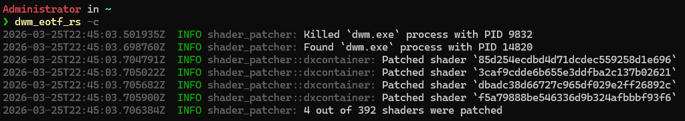

# About
An alternative implementation of the same idea that is behind [dwm_eotf](https://github.com/ledoge/dwm_eotf). 

This version is more reliable, as it does not require multiple tries for it to work (as far as I can tell). It also has additional features, such as system tray controls.

`dwm_eotf_rs` works by reading memory of the loaded `dwmcore.dll` module, patching shaders that are responsible for incorrect SDR to HDR conversions there and writing it back.

# Usage

## Help Output
```
Patches DWM's shaders to use proper EOTF (gamma)

Usage: dwm_eotf_rs.exe [OPTIONS] [GAMMA]

Arguments:
  [GAMMA]  Gamma for compatibility mode [default: 2.2]

Options:
  -c, --compatibility-mode  The app will patch DWM and exit immidiately
  -s, --skip-patching       The tray mode will not patch DWM at the start
  -r, --restore             Restores original EOTF by restarting the DWM
  -h, --help                Print help
  -V, --version             Print version
```

### Tray Mode
You can toggle the patch using a system tray icon, as well as select gamma value (2.0/2.2/2.4/[GAMMA]).

|---------------------|---------------------|
|||

### Compatibility Mode
Patches DWM and exits.



## Library

dwm_eotf_rs depends on `shader_patcher` library from this repository that can be used to implement patching of other apps.

# Known Issues
- Chromium-based apps (Web browsers, VS Code, etc) also use incorrect curves and will switch back and forth between original and fixed look sometimes.

# Acknowledgements
- Many thanks to [ledoge](https://github.com/ledoge) for original C implementation.
