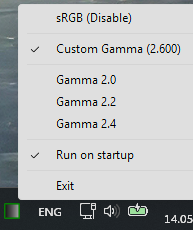
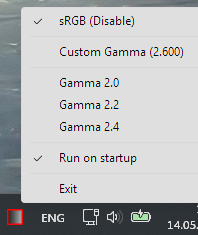
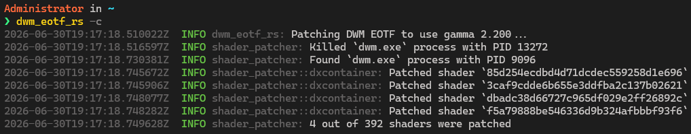

# About
An alternative implementation of the same idea that is behind [dwm_eotf](https://github.com/ledoge/dwm_eotf). 

This version is more reliable, as it does not require multiple tries for it to work (as far as I can tell). It also has additional features, such as system tray controls and shader dumping.

`dwm_eotf_rs` works by reading memory of the loaded `dwmcore.dll` module, patching shaders that are responsible for incorrect SDR to HDR conversions there and writing it back.

# Usage

## Help Output
```
Patches DWM's shaders to use proper EOTF (gamma)

Usage: dwm_eotf_rs.exe [OPTIONS] [GAMMA]

Arguments:
  [GAMMA]  Exponent to use during EOTF patching [default: 2.2]

Options:
  -c, --compatibility-mode       Patches DWM and exits (disables tray icon)
  -s, --skip-patching            Prevents automatic patching on app start (only if tray icon is enabled)
  -i, --ignore-whitelist         Patch every shader with matching patterns
  -r, --restore                  Restores original sRGB EOTF (by restarting DWM) and exits
  -d, --dump-shaders             Dumps DWM's original shaders as DXBC and exits
      --big-shaders              Prevents recursive dumping of sub-shaders
      --output-dir <OUTPUT_DIR>  Target directory for dumped DXBC files [default: shaders/dumped]
  -h, --help                     Print help
  -V, --version                  Print version
```

### Tray Mode
It's possible to toggle the patch using a system tray icon, as well as select gamma value (2.0/2.2/2.4/[GAMMA]).

|||
|---------------------|---------------------|
|||

### Compatibility Mode
This mode turns `dwm_eotf_rs` into a simple console app - it patches DWM and exits.



## Shader Dumping
The app can dump DWM's shaders as DXBC files for research purposes.

These shaders are nested. There are 30 top-level shaders and hundreds of sub-shaders.

## Whitelist
By default, `dwm_eotf_rs` will patch only 4 shaders selected by ledoge. I think this covers most use cases, but it's possible to patch all shaders with same patterns by using `--ignore-whitelist` flag.

## Library

dwm_eotf_rs depends on `shader_patcher` library from this repository that can be used to implement patching of other apps.

# Known Issues
- Chromium-based apps (Web browsers, VS Code, etc) also use incorrect curves and will switch back and forth between original and fixed look sometimes. Setting `force-color-profile` to `hdr10` will help somewhat.

# Acknowledgements
- Many thanks to [ledoge](https://github.com/ledoge) for original C implementation.
