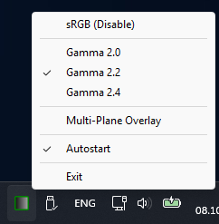
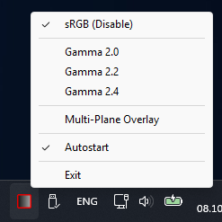
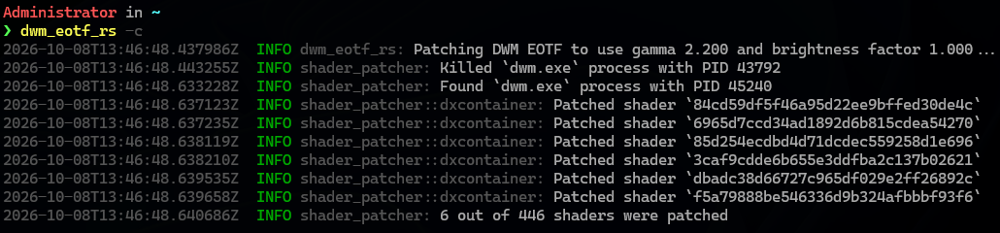

# About

When HDR is enabled, almost all SDR content in Windows looks wrong and washed out, even it's own UI. `dwm_eotf_rs` solves this problem by replacing Desktop Window Manager's piecewise sRGB transfer function with [proper gamma curve](https://github.com/dylanraga/win11hdr-srgb-to-gamma2.2-icm). 

It does that by reading memory of the loaded `dwmcore.dll` module, patching shaders that are responsible for incorrect SDR to HDR conversions and writing it back.

This is an alternative implementation of the same idea that is behind [dwm_eotf](https://github.com/ledoge/dwm_eotf). `dwm_eotf_rs` is a major upgrade in terms of QoL, it also provides additional features, such as system tray controls, Multi-Plane Overlay toggle, autostart and shader dumping. It's more reliable as well, as it does not require multiple retries for it to work and it's brightness scaling feature is less buggy.

**You do not need to disable/revert the patch (or restart DWM) when playing HDR games or videos. It only affects DWM composed SDR content!**

# Usage

## Help Output
```
Patches DWM's shaders to use proper EOTF (gamma)

Usage: dwm_eotf_rs.exe [OPTIONS] [GAMMA] [COMMAND]

Commands:
  dump        Dumps DWM's original shaders as DXBC
  restore     Restores original sRGB EOTF and enables Multi-Plane Overlay
  schedule    Creates a task ('dwm_eotf_rs') that runs the app on user logon
  unschedule  Removes the startup task from Task Scheduler
  help        Print this message or the help of the given subcommand(s)

Arguments:
  [GAMMA]  Exponent to use during EOTF patching [default: 2.2]

Options:
  -c, --compatibility-mode       Patch DWM and exit (disables tray mode)
  -m, --mpo-state <MPO_STATE>    Optional Multi-Plane Overlay toggle (set to false to prevent some apps from bypassing DWM) [possible values: true, false]
  -n, --nits <NITS>              Optional target SDR brightness in nits (depends on display setup, see ReadMe)
  -i, --ignore-whitelist         Patch every shader that contains sRGB EOTF or alpha correction patterns
  -s, --skip-patching            Prevent automatic patching on app start (tray mode only)
  -w, --wait-time <WAIT_TIME>    Delay (in seconds) before patching on start (tray mode only) [default: 5]
      --brightness <BRIGHTNESS>  Optional brightness multiplier (legacy dwm_eotf compatible factor)
      --no-alpha-fix             Disable alpha correction fix when increasing brightness (see ReadMe)
  -h, --help                     Print help
  -V, --version                  Print version
```

## Tray Mode
By default, the app runs in system tray, where you can toggle patch as needed as well as select a gamma value (2.0/2.2/2.4/[GAMMA]).

When it launches, it will wait a few seconds (specified by `-w` option) before inital patching to avoid problems in some edge cases.

|||
|---------------------|---------------------|
|||

## Compatibility Mode
When supplied with the `-c` flag, `dwm_eotf_rs` works like a simple console app - it patches DWM and exits.



## Startup

The app can register itself to run automatically when user logs in, using the Windows Task Scheduler (task named `dwm_eotf_rs`).

The `-c schedule` argument combination schedules `dwm_eotf_rs` to autostart in Compatibility Mode. **This is the intended way to use the app.**

In tray mode, the context menu includes an "Autostart" checkable item that toggles the startup task on or off. If the gamma value is changed while autostart is on, the task is updated to use the new gamma.

## Brightness Control

It's possible to set a desired paper white brightness in nits using the `-n` option. `dwm_eotf_rs` takes the highest SDR content brightness value of all your displays (as set in Windows Settings) and calculates the scaling factor for EOTF. The program additionally patches "AlphaCorrectSDR", "BoostSDRLuminance" and similar shaders to fix UI transparancy issues introduced by brightness scaling.

The `--brightness` option allows to set a brightness multiplier directly, but uses the math compatible with original `dwm_eotf` and might not be interpreted in terms of nits.

## Multi-Plane Overlay

Some apps and most games use the Multi-Plane Overlay (MPO) GPU feature to render their UI directly (so called "Independent Flip"), bypassing DWM and it's shaders (patched or otherwise). Most Electron and NW.js apps (e.g. VS Code, RPGM), Unity games, Chromium-based browsers and a lot of others use MPO.

`dwm_eotf_rs` will disable/enable MPO via registry when `-m false`/`-m true` is provided. There is also a relevant toggle in Tray Mode.

Do note that some apps and games will force Independent Flip if it's fullscreen anyway (when nothing obscures the app's window, to be more precise). Disabling MPO might also reduce performance of games.

## Whitelist
By default, `dwm_eotf_rs` will patch a predefined set of shaders (and an extra set when using `--nits`/`--brightness` without `--no-alpha-fix`). It should cover most use cases, but it's possible to patch all shaders with same patterns with an `-i` flag.

## Shader Dumping
The app can dump DWM's shaders as DXBC files for research purposes.

These shaders are nested. There are 30 top-level shaders and hundreds inside. Use `--big-shaders` flag to dump only former.

# Library

dwm_eotf_rs depends on `shader_patcher` library from this repository that can be used to implement patching of other apps.

# Known Issues
- Chromium, NW.js and Electron-based apps (Web browsers, VS Code, RPGM games, etc) also use incorrect curves and will switch back and forth between original and fixed look sometimes. 
  - Setting `--force-color-profile` option (same as `#force-color-profile` in browser flags) to `hdr10` or `scrgb-linear` will remove flicker, but the app will use it's own HDR implementation.
  - Alternatively, set that flag to `srgb` and disable MPO (see section on Multi-Plane Overlay above). This will fix flicker and allow `dwm_eotf_rs` to work at the cost of HDR.
- As mentioned above, some SDR games bypass DWM when in fullscreen regardless of MPO settings, so the `dwm_eotf_rs` will not help. You can use ReShade with [Lilium's](https://github.com/EndlesslyFlowering/ReShade_HDR_shaders) "SDR TRC Fix" shader in such cases.

# Acknowledgements
- Many thanks to [ledoge](https://github.com/ledoge) for original C implementation.